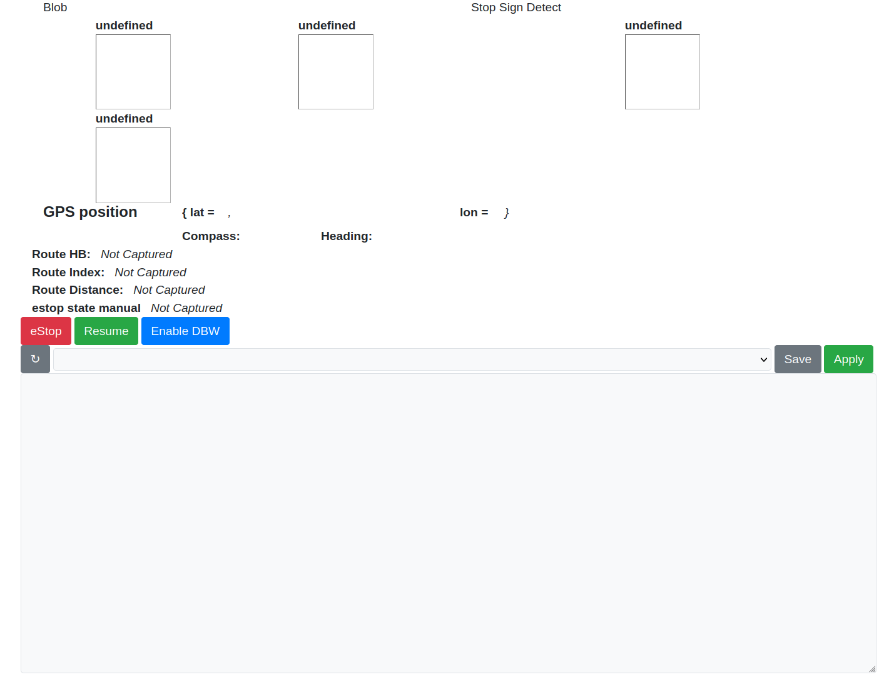

# LTU-Actor Core

This is the main package of the LTU-Actor autonomous vehicle platfor. It has
the other packages in this organizations as submodules to track the version
used with this version of Core.

## Getting Started

Ubuntu 16.04 (ROS Kinetic) only ships with version 4.x, and we need
significantly newer to run the webpage. This is the official nodejs ppa.

```sh
curl -sL https://deb.nodesource.com/setup_10.x | sudo -E bash -
```

Now is a good time to clone in all the other Actor packages that will be used by the router:

```sh
git clone https://github.com/LTU-Actor/Core.git
git clone https://github.com/LTU-Actor/AdapParameter.git
git clone https://github.com/LTU-Actor/InputProcess-CamAdjust.git
git clone https://github.com/LTU-Actor/Route-Blob.git
git clone https://github.com/LTU-Actor/Route-Obstacle.git
git clone https://github.com/LTU-Actor/Route-Pothole.git
git clone https://github.com/LTU-Actor/Route-Spline.git
git clone https://github.com/LTU-Actor/Route-StopSign.git
git clone https://github.com/LTU-Actor/Route-Waypoint.git
```

Run [rosdep](http://wiki.ros.org/rosdep) to install all dependencies (including nodejs).

```sh
rosdep install --from-paths src --ignore-src -r -y
```

And compile with catkin isolated.

```sh
catkin_make_isolated
```

### Running

The rosbridge (webpage ros api), video server (webpage access to video topics), router (main node), and simple webpage with:

```sh
roslaunch ltu_actor_core core.launch
```

then view the page <http://localhost:3000/>

#### Example Launchfile

```xml
<launch>
  <include file="$(ltu_actor_core)/launch/core.launch">
    <arg name="rosbridge_port" value="8090" />
    <arg name="http_video_port" value="8091" />
    <arg name="script_folder" value="$HOME" />
    <arg name="estop_service" value="/estop/estop" />
    <arg name="navsatfix_topic" value="/navsatfix" />

    <arg name="video1" default="/video1" />
    <arg name="video2" default="/video2" />
    <arg name="video3" default="/video3" />
    <arg name="video4" default="/video4" />
  </include>
</launch>
```

# Using the web app



The above is taken of the system running with one of the recordings from the
[Vehicle-GEM](https://github.com/LTU-Actor/Vehicle-GEM) package. Scripts build
for the Actor GEM are also commited to the
[Vehicle-GEM/routes/](https://github.com/LTU-Actor/Vehicle-GEM/tree/master/routes)
folder.

#### UI Parts:

- Four video topics are displayed as configured in the launchfile arguments
- The "Route HB" or heartbeat toggles true/false when the `heartbeat()` script
  function is called, signaling that the route script is still running. In
  order for this to work, the route script must ensure that the function is
  called within every long loop.
- Route Index and Route Distance are updated by the `info_*` functions, and are
  used in routes do display various status numbers (e.g. the distance to the
  next waypoint and the waypoint number).
- estop state manual shows if the manual estop buttons are pressed. This is
  assumed to be `std_msgs/Bool` on `/estop/state`, or configured as a lunch
  file argument.
- All the following information pertains directly to the selection, control,
  and modification of route scripts:
  - The main textbox shows the currently loaded route. This may either be a
    file stored on the actor computer, or the modified version in ram only.
  - The reload arrow will re-sync the browser to the route server incase
    another browser has made a change, or the system has been re-loaded.
  - The dropdown menu will show all files in the configured `routes/` folder.
    Selecting one will load and begin running that rout, destroying and
    non-saved changes to the current route. Selecting a new route will also
    trigger the software-estop.
  - The save button will send any changes to the textbox to the route server,
    save them to the file, apply the changes, begin running the route, and
    trigger the software estop.
  - The load button will reload the route from the file selected in the
    dropdown menu. Any changes in memory will be destroyed. The file contents
    will be sent back to the browser, the origional route will begin running,
    and the software estop is triggered.
  - The apply button will send the contents of the browser to the route server,
    and run them **without** saving them to disk. The software estop will be
    triggered.
  - The estop button will trigger the software estop.
  - The resume button is the only way to clear the software estop, and allow a
    non-zero command to be sent to the dbw system.

## Example course

An example of the course this router has been used for can be seen below. A video of the functions demonstrated on this course is in the docs folder [here](https://youtu.be/ySQW8pPQn4A)


#### The route:

The route scripts are written in Lua, and have access to a handful of custom functions/variables bound from the router host. In addition, the host will execute the [setup.lua](./src/router/setup.lua) file when each Lua script's environment is initalized. The lua state is rebuild before before each script is started.

The script below is an example of the flexability of the scripting language. It instructs the vehicle to follow a list of waypoints using the [Route-Waypoint](https://github.com/LTU-Actor/Route-Waypoint) package.

```lua
wps = {
  {lat=42.474577731988404, lon=-83.24978459935954}, -- after long
  {lat=42.474443020559235, lon=-83.24961630603279}, -- 3 shield
  {lat=42.4743747342588,   lon=-83.24948869708074}, -- rusty stick
  {lat=42.47435906661956,  lon=-83.24932813838758}, -- sidewalk
  {lat=42.4743974394603,   lon=-83.24915945160514}, -- tree 5
  {lat=42.47448536517313,  lon=-83.24899809469223}, -- tree 2
  {lat=42.47457155453122,  lon=-83.24888768798787}, -- exit curve
  {lat=42.47462683972605,  lon=-83.24875816602247}, -- charles tree
  {lat=42.474935949391856, lon=-83.24834024117531}  -- fire hydrant
}

local wp = 1

send_topic("/waypoint/cmd")
while wps[wp] ~= nil do
  heartbeat()
  pub_latlong(wps[wp].lat, wps[wp].lon, "/waypoint/waypoint")
  local d = dist(wps[wp].lat, wps[wp].lon)

  -- show on webpage
  info_distance(d)
  info_index(wp)

  if d < 1.0 then wp = wp + 1 end
  spin_for(100)
end
```

The route can be seen doing the following things:

- Maintaining state for the next waypoint with the `wp` variable
- Instructing the router to forward the vehicle commands from the
  Route-Waypoint output topic with `send_topic("/waypoint/cmd")`. Forwarded
  topics are expected to be `geometry_msgs/Twist` in the standard format
  (linear.x and angular.z for car control). This topic will be forwarded until
  the `send_topic` function is called again, or until the script exits.
- In the loop, the heartbeat function is called to notify the webpage that it
  is still running.
- `pub_latlong` is a function bound into the Lua state by the router. It
  published to a subscriber that is known to communicate with the
  Route-Waypoint node. This publisher is created on the first call to this
  function.
- the `info_*` functions display status information to the webpage. In this
  instance, they are the current waypoint target's index, and the distance to
  it.
- The loop swaps to the next waypoint when the vehicle is within one meter of
  the target. `dist()` is another custom function, which in this case if
  created in the setup script. It returns the distance of the vehicle to a
  lat/long in meters.
- `spin_for` is simmilar to a `sleep(ms)` call, but will allow ROS to spin in
  the meantime. `spin_once` can be called to call `ros::spinOnce` without
  delay. This function **must** be called repeatedly in order for the router to
  continue functioning.

Many of the custom functions and variabled can be seen in the comment at the top of the [default route](./src/router/default_route.lua):

```lua
--[[
  heartbeat()                           toggle the heartbeat status topic to show the route is running
  spin_once()                           allow ROS topics/services to be serviced
  spin_for(int ms)                      delay for milliseconds while also servicing ROS
  send(float linear, float angular)     continuously send cmd commands (forward/reverse & steering)
  send_topic(string topic)              continuously forward a Twist topic as for cmd instead of constants
  dist(double lat, double long)         get the distance in meters from the gps point
  last_float32(string topic)            get the value of a topic (replace Float32 with any std_msgs type)
  pub_float32(string topic, float val)  oppisite of above, publish on a topic
  info_index(int i)                     show an int "index" on the webpage
  info_distance(float d)                show a float "distance" on the wepbage
  estop()                               trigger an estop
]]--


while true
do
  send(0.0, 0.0)
  heartbeat()
  spin_for(500)
end
```
